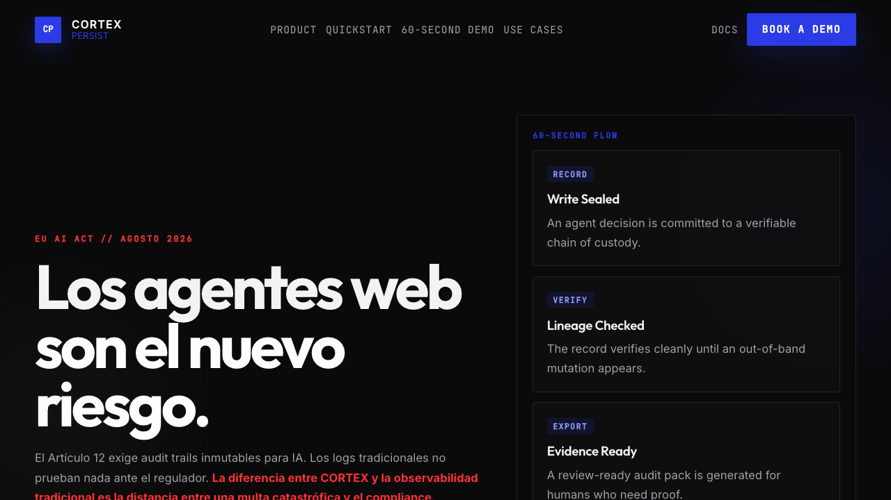

# cortexpersist-landing

Landing-page case study for the original CORTEX Persist launch surface.



## Objective

This repository packages the original marketing and positioning layer for CORTEX Persist into a single static artifact.

The goal was not to build a generic SaaS landing page. The goal was to explain AI trust infrastructure, cryptographic lineage, and compliance positioning in a page that feels technical, fast, and deliberate.

## Case Study

### Problem

AI infrastructure products are hard to explain quickly. A trust layer for agent memory is even harder, because the value sits in integrity guarantees and auditability rather than a flashy user-facing feature.

### Approach

The page is intentionally framework-light:

- single-file delivery for portability and easy hosting
- strong information hierarchy around trust, auditability, and compliance
- industrial-noir visual language instead of default startup gradients
- direct calls to the core product and documentation instead of marketing filler

### Result

The page works as a compact product narrative for early discovery, demos, and investor or partner context while keeping the implementation simple enough to host anywhere.

## Stack

- Static HTML and CSS
- Inline JavaScript only where needed
- Portable deploy on any static host

## Local Setup

```bash
python3 -m http.server 4173
```

Then open `http://127.0.0.1:4173`.

## Repository Notes

- [`index.html`](index.html) contains the complete landing page.
- [`assets/marketing`](assets/marketing) stores supporting launch visuals.
- [`assets/og-image.png`](assets/og-image.png) is the social preview image.

## Status

Public case study kept visible as part of the flagship surface around CORTEX Persist.

See [`LICENSE`](LICENSE) for reuse limits.
